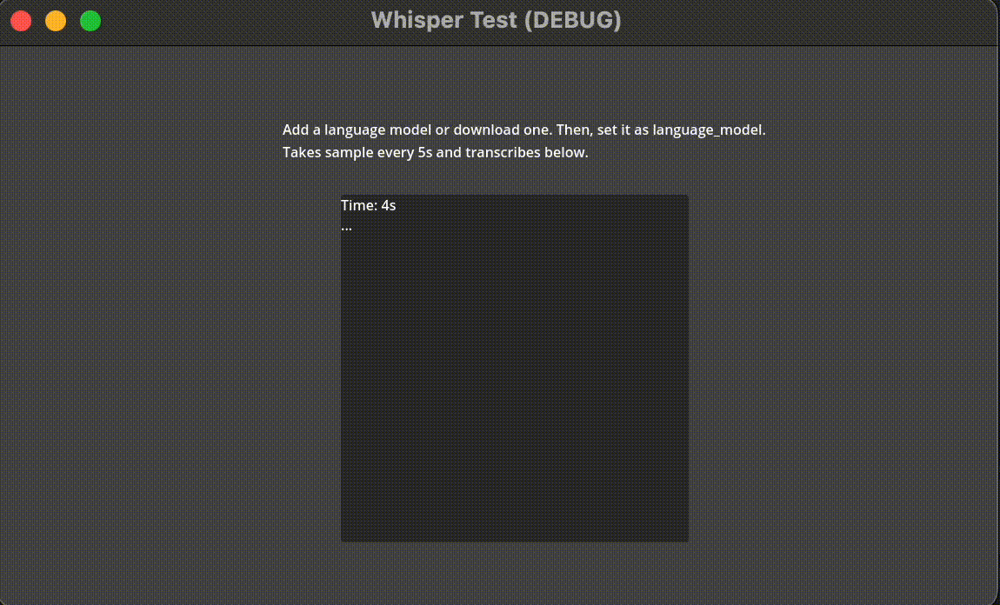

# Godot Whisper

	
    
    
    
    
    

<!-- ALL-CONTRIBUTORS-BADGE:START - Do not remove or modify this section -->

<!-- ALL-CONTRIBUTORS-BADGE:END -->

## How to install

Go to a github release, copy paste the addons folder to the demo folder. Restart godot editor.

## SpeechToText

`SpeechToText` Node has a `transcribe` which gets a buffer that it transcribes.

## CaptureStreamToText

`CaptureStreamToText` - extends SpeechToText and runs transcribe function every 5 seconds.

## Main thread

The transcribe can block the main thread. It should run in about 0.5 seconds every 5 seconds, but check for yourself.

## Language Model

Go to a `CaptureStreamToText` node, select a Language Model to Download and click Download. You might have to alt tab editor or restart for asset to appear. Then, select `language_model` property.

## Contributors ✨

Thanks goes to these wonderful people ([emoji key](https://allcontributors.org/docs/en/emoji-key)):

<!-- ALL-CONTRIBUTORS-LIST:START - Do not remove or modify this section -->
<!-- prettier-ignore-start -->
<!-- markdownlint-disable -->
<table>
  <tbody>
    <tr>
      <td align="center" valign="top" width="14.28%"><a href="https://github.com/Ughuuu"> <b>Dragos Daian</b></a> <a href="https://github.com/V-Sekai/v-sekai.whisper/commits?author=Ughuuu" title="Code">💻</a></td>
      <td align="center" valign="top" width="14.28%"><a href="https://chibifire.com"> <b>K. S. Ernest (iFire) Lee</b></a> <a href="https://github.com/V-Sekai/v-sekai.whisper/commits?author=fire" title="Code">💻</a></td>
    </tr>
  </tbody>
</table>

<!-- markdownlint-restore -->
<!-- prettier-ignore-end -->

<!-- ALL-CONTRIBUTORS-LIST:END -->

This project follows the [all-contributors](https://github.com/all-contributors/all-contributors) specification. Contributions of any kind welcome!
